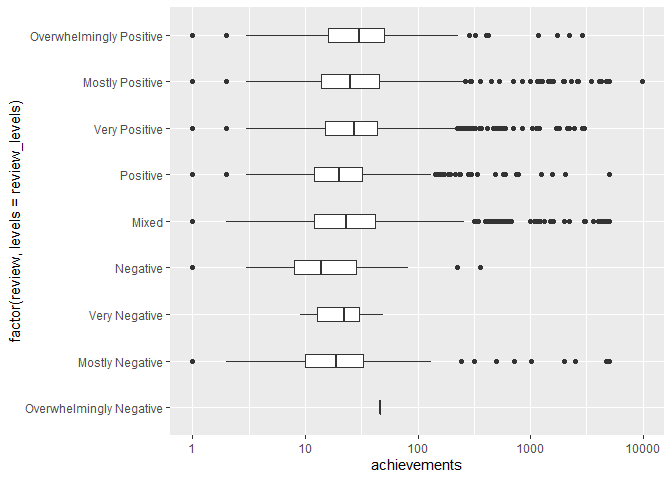
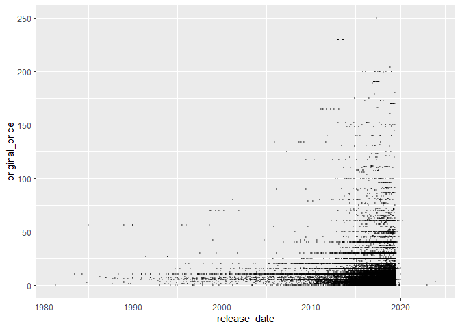

Mini Data-Analysis Deliverable 1
================

# Introduction

This mini-data analysis aims to explore, analyze and present data from
databases using *R* and *tidyverse*. Data manipulation and analysis was
done using *dplyr* package. *ggplot2* was used for data visualization.
The datasets are taken from *datateachr* package.

The learning objectives of this section is:

-   Become familiar with your dataset of choosing

-   Think of 4 questions that you would like to answer with your data

-   Generate a reproducible and clear report using R Markdown

Load necessary packages for this project.

``` r
library(datateachr)
library(tidyverse)
```

    ## -- Attaching packages --------------------------------------- tidyverse 1.3.1 --

    ## v ggplot2 3.3.5     v purrr   0.3.4
    ## v tibble  3.1.4     v dplyr   1.0.7
    ## v tidyr   1.1.3     v stringr 1.4.0
    ## v readr   2.0.2     v forcats 0.5.1

    ## -- Conflicts ------------------------------------------ tidyverse_conflicts() --
    ## x dplyr::filter() masks stats::filter()
    ## x dplyr::lag()    masks stats::lag()

# Task 1: Choose your favorite dataset (10 points)

The data sets were chosen from the `datateachr` package as listed below.

-   *apt_buildings*: Acquired courtesy of The City of Toronto’s Open
    Data Portal. It currently has 3455 rows and 37 columns.

-   *building_permits*: Acquired courtesy of The City of Vancouver’s
    Open Data Portal. It currently has 20680 rows and 14 columns.

-   *cancer_sample*: Acquired courtesy of UCI Machine Learning
    Repository. It currently has 569 rows and 32 columns.

-   *flow_sample*: Acquired courtesy of The Government of Canada’s
    Historical Hydrometric Database. It currently has 218 rows and 7
    columns.

-   *parking_meters*: Acquired courtesy of The City of Vancouver’s Open
    Data Portal. It currently has 10032 rows and 22 columns.

-   *steam_games*: Acquired courtesy of Kaggle. It currently has 40833
    rows and 21 columns.

-   *vancouver_trees*: Acquired courtesy of The City of Vancouver’s Open
    Data Portal. It currently has 146611 rows and 20 columns.

### 1.1 Choose four dataset .

1: apt_buildings  
2: cancer_sample  
3: steam_games  
4: building_permits

### 1.2 Exploring the four datasets

One way to narrowing down your selection is to *explore* the datasets.
Explore datasets by investigating *3* attributes in each of these
datasets. The goal here is to have an idea of *what the data looks
like*.

***1.2.1 apt_building data overview***

``` r
glimpse(apt_buildings)
```

    ## Rows: 3,455
    ## Columns: 37
    ## $ id                               <dbl> 10359, 10360, 10361, 10362, 10363, 10~
    ## $ air_conditioning                 <chr> "NONE", "NONE", "NONE", "NONE", "NONE~
    ## $ amenities                        <chr> "Outdoor rec facilities", "Outdoor po~
    ## $ balconies                        <chr> "YES", "YES", "YES", "YES", "NO", "NO~
    ## $ barrier_free_accessibilty_entr   <chr> "YES", "NO", "NO", "YES", "NO", "NO",~
    ## $ bike_parking                     <chr> "0 indoor parking spots and 10 outdoo~
    ## $ exterior_fire_escape             <chr> "NO", "NO", "NO", "YES", "NO", NA, "N~
    ## $ fire_alarm                       <chr> "YES", "YES", "YES", "YES", "YES", "Y~
    ## $ garbage_chutes                   <chr> "YES", "YES", "NO", "NO", "NO", "NO",~
    ## $ heating_type                     <chr> "HOT WATER", "HOT WATER", "HOT WATER"~
    ## $ intercom                         <chr> "YES", "YES", "YES", "YES", "YES", "Y~
    ## $ laundry_room                     <chr> "YES", "YES", "YES", "YES", "YES", "Y~
    ## $ locker_or_storage_room           <chr> "NO", "YES", "YES", "YES", "NO", "YES~
    ## $ no_of_elevators                  <dbl> 3, 3, 0, 1, 0, 0, 0, 2, 4, 2, 0, 2, 2~
    ## $ parking_type                     <chr> "Underground Garage , Garage accessib~
    ## $ pets_allowed                     <chr> "YES", "YES", "YES", "YES", "YES", "Y~
    ## $ prop_management_company_name     <chr> NA, "SCHICKEDANZ BROS. PROPERTIES", N~
    ## $ property_type                    <chr> "PRIVATE", "PRIVATE", "PRIVATE", "PRI~
    ## $ rsn                              <dbl> 4154812, 4154815, 4155295, 4155309, 4~
    ## $ separate_gas_meters              <chr> "NO", "NO", "NO", "NO", "NO", "NO", "~
    ## $ separate_hydro_meters            <chr> "YES", "YES", "YES", "YES", "YES", "Y~
    ## $ separate_water_meters            <chr> "NO", "NO", "NO", "NO", "NO", "NO", "~
    ## $ site_address                     <chr> "65  FOREST MANOR RD", "70  CLIPPER R~
    ## $ sprinkler_system                 <chr> "YES", "YES", "NO", "YES", "NO", "NO"~
    ## $ visitor_parking                  <chr> "PAID", "FREE", "UNAVAILABLE", "UNAVA~
    ## $ ward                             <chr> "17", "17", "03", "03", "02", "02", "~
    ## $ window_type                      <chr> "DOUBLE PANE", "DOUBLE PANE", "DOUBLE~
    ## $ year_built                       <dbl> 1967, 1970, 1927, 1959, 1943, 1952, 1~
    ## $ year_registered                  <dbl> 2017, 2017, 2017, 2017, 2017, NA, 201~
    ## $ no_of_storeys                    <dbl> 17, 14, 4, 5, 4, 4, 4, 7, 32, 4, 4, 7~
    ## $ emergency_power                  <chr> "NO", "YES", "NO", "NO", "NO", "NO", ~
    ## $ `non-smoking_building`           <chr> "YES", "NO", "YES", "YES", "YES", "NO~
    ## $ no_of_units                      <dbl> 218, 206, 34, 42, 25, 34, 14, 105, 57~
    ## $ no_of_accessible_parking_spaces  <dbl> 8, 10, 20, 42, 12, 0, 5, 1, 1, 6, 12,~
    ## $ facilities_available             <chr> "Recycling bins", "Green Bin / Organi~
    ## $ cooling_room                     <chr> "NO", "NO", "NO", "NO", "NO", "NO", "~
    ## $ no_barrier_free_accessible_units <dbl> 2, 0, 0, 42, 0, NA, 14, 0, 0, 1, 25, ~

This data set looks at various apartment buildings and explores various
aspects of each building. There are 37 variables in the apt_building
data set. 28 variables are character data type and 9 variables are
double-precision floating point number data type. There are 3,455
apartment buildings recorded in this dataset.

***1.2.2 cancer_sample data overview***

``` r
### Variables in cencer_sample ###
summary(cancer_sample)
```

    ##        ID             diagnosis          radius_mean      texture_mean  
    ##  Min.   :     8670   Length:569         Min.   : 6.981   Min.   : 9.71  
    ##  1st Qu.:   869218   Class :character   1st Qu.:11.700   1st Qu.:16.17  
    ##  Median :   906024   Mode  :character   Median :13.370   Median :18.84  
    ##  Mean   : 30371831                      Mean   :14.127   Mean   :19.29  
    ##  3rd Qu.:  8813129                      3rd Qu.:15.780   3rd Qu.:21.80  
    ##  Max.   :911320502                      Max.   :28.110   Max.   :39.28  
    ##  perimeter_mean     area_mean      smoothness_mean   compactness_mean 
    ##  Min.   : 43.79   Min.   : 143.5   Min.   :0.05263   Min.   :0.01938  
    ##  1st Qu.: 75.17   1st Qu.: 420.3   1st Qu.:0.08637   1st Qu.:0.06492  
    ##  Median : 86.24   Median : 551.1   Median :0.09587   Median :0.09263  
    ##  Mean   : 91.97   Mean   : 654.9   Mean   :0.09636   Mean   :0.10434  
    ##  3rd Qu.:104.10   3rd Qu.: 782.7   3rd Qu.:0.10530   3rd Qu.:0.13040  
    ##  Max.   :188.50   Max.   :2501.0   Max.   :0.16340   Max.   :0.34540  
    ##  concavity_mean    concave_points_mean symmetry_mean    fractal_dimension_mean
    ##  Min.   :0.00000   Min.   :0.00000     Min.   :0.1060   Min.   :0.04996       
    ##  1st Qu.:0.02956   1st Qu.:0.02031     1st Qu.:0.1619   1st Qu.:0.05770       
    ##  Median :0.06154   Median :0.03350     Median :0.1792   Median :0.06154       
    ##  Mean   :0.08880   Mean   :0.04892     Mean   :0.1812   Mean   :0.06280       
    ##  3rd Qu.:0.13070   3rd Qu.:0.07400     3rd Qu.:0.1957   3rd Qu.:0.06612       
    ##  Max.   :0.42680   Max.   :0.20120     Max.   :0.3040   Max.   :0.09744       
    ##    radius_se        texture_se      perimeter_se       area_se       
    ##  Min.   :0.1115   Min.   :0.3602   Min.   : 0.757   Min.   :  6.802  
    ##  1st Qu.:0.2324   1st Qu.:0.8339   1st Qu.: 1.606   1st Qu.: 17.850  
    ##  Median :0.3242   Median :1.1080   Median : 2.287   Median : 24.530  
    ##  Mean   :0.4052   Mean   :1.2169   Mean   : 2.866   Mean   : 40.337  
    ##  3rd Qu.:0.4789   3rd Qu.:1.4740   3rd Qu.: 3.357   3rd Qu.: 45.190  
    ##  Max.   :2.8730   Max.   :4.8850   Max.   :21.980   Max.   :542.200  
    ##  smoothness_se      compactness_se      concavity_se     concave_points_se 
    ##  Min.   :0.001713   Min.   :0.002252   Min.   :0.00000   Min.   :0.000000  
    ##  1st Qu.:0.005169   1st Qu.:0.013080   1st Qu.:0.01509   1st Qu.:0.007638  
    ##  Median :0.006380   Median :0.020450   Median :0.02589   Median :0.010930  
    ##  Mean   :0.007041   Mean   :0.025478   Mean   :0.03189   Mean   :0.011796  
    ##  3rd Qu.:0.008146   3rd Qu.:0.032450   3rd Qu.:0.04205   3rd Qu.:0.014710  
    ##  Max.   :0.031130   Max.   :0.135400   Max.   :0.39600   Max.   :0.052790  
    ##   symmetry_se       fractal_dimension_se  radius_worst   texture_worst  
    ##  Min.   :0.007882   Min.   :0.0008948    Min.   : 7.93   Min.   :12.02  
    ##  1st Qu.:0.015160   1st Qu.:0.0022480    1st Qu.:13.01   1st Qu.:21.08  
    ##  Median :0.018730   Median :0.0031870    Median :14.97   Median :25.41  
    ##  Mean   :0.020542   Mean   :0.0037949    Mean   :16.27   Mean   :25.68  
    ##  3rd Qu.:0.023480   3rd Qu.:0.0045580    3rd Qu.:18.79   3rd Qu.:29.72  
    ##  Max.   :0.078950   Max.   :0.0298400    Max.   :36.04   Max.   :49.54  
    ##  perimeter_worst    area_worst     smoothness_worst  compactness_worst
    ##  Min.   : 50.41   Min.   : 185.2   Min.   :0.07117   Min.   :0.02729  
    ##  1st Qu.: 84.11   1st Qu.: 515.3   1st Qu.:0.11660   1st Qu.:0.14720  
    ##  Median : 97.66   Median : 686.5   Median :0.13130   Median :0.21190  
    ##  Mean   :107.26   Mean   : 880.6   Mean   :0.13237   Mean   :0.25427  
    ##  3rd Qu.:125.40   3rd Qu.:1084.0   3rd Qu.:0.14600   3rd Qu.:0.33910  
    ##  Max.   :251.20   Max.   :4254.0   Max.   :0.22260   Max.   :1.05800  
    ##  concavity_worst  concave_points_worst symmetry_worst   fractal_dimension_worst
    ##  Min.   :0.0000   Min.   :0.00000      Min.   :0.1565   Min.   :0.05504        
    ##  1st Qu.:0.1145   1st Qu.:0.06493      1st Qu.:0.2504   1st Qu.:0.07146        
    ##  Median :0.2267   Median :0.09993      Median :0.2822   Median :0.08004        
    ##  Mean   :0.2722   Mean   :0.11461      Mean   :0.2901   Mean   :0.08395        
    ##  3rd Qu.:0.3829   3rd Qu.:0.16140      3rd Qu.:0.3179   3rd Qu.:0.09208        
    ##  Max.   :1.2520   Max.   :0.29100      Max.   :0.6638   Max.   :0.20750

``` r
# Number of benign and malignant tumor samples in dataset
cancer_sample %>%
  group_by(diagnosis) %>%
  summarize(n=n())
```

    ## # A tibble: 2 x 2
    ##   diagnosis     n
    ##   <chr>     <int>
    ## 1 B           357
    ## 2 M           212

``` r
ncol(cancer_sample) # Number of column
```

    ## [1] 32

``` r
nrow(cancer_sample) # Number of row
```

    ## [1] 569

The cancer_sample dataset looks at various cancer samples in patients.
569 cancer samples were included in this data set. For each cancer
sample, the diagnosis variable categorizes samples as benign (b) or
malignant (m). Moreover, the mean, standard deviation and worst radius,
texture, permeter, area, smoothness, compactness, concavity, concavity
points, symmetry and fractal dimension were investigated for each cancer
sample. With the exception of diagnosis variable which was a character
data type, the other variables were all double-precision floating point
number data type.

***1.2.3 steam_games data overview***

``` r
# Show first 6 games in database
head(steam_games) 
```

    ## # A tibble: 6 x 21
    ##      id url    types  name  desc_snippet recent_reviews all_reviews release_date
    ##   <dbl> <chr>  <chr>  <chr> <chr>        <chr>          <chr>       <chr>       
    ## 1     1 https~ app    DOOM  Now include~ Very Positive~ Very Posit~ May 12, 2016
    ## 2     2 https~ app    PLAY~ PLAYERUNKNO~ Mixed,(6,214)~ Mixed,(836~ Dec 21, 2017
    ## 3     3 https~ app    BATT~ Take comman~ Mixed,(166),-~ Mostly Pos~ Apr 24, 2018
    ## 4     4 https~ app    DayZ  The post-so~ Mixed,(932),-~ Mixed,(167~ Dec 13, 2018
    ## 5     5 https~ app    EVE ~ EVE Online ~ Mixed,(287),-~ Mostly Pos~ May 6, 2003 
    ## 6     6 https~ bundle Gran~ Grand Theft~ NaN            NaN         NaN         
    ## # ... with 13 more variables: developer <chr>, publisher <chr>,
    ## #   popular_tags <chr>, game_details <chr>, languages <chr>,
    ## #   achievements <dbl>, genre <chr>, game_description <chr>,
    ## #   mature_content <chr>, minimum_requirements <chr>,
    ## #   recommended_requirements <chr>, original_price <dbl>, discount_price <dbl>

``` r
ncol(steam_games) # Number of column (variables) in dataset
```

    ## [1] 21

``` r
nrow(steam_games) # Number of rows (games) in dataset
```

    ## [1] 40833

The third data set I choose was steam_games. This data set looks at
40833 steam games. There is 21 variables recorded for each game. The id,
achievements, original_price and discount_price are in double-precision
floating point number data type while the rest are character data type.
Interestingly, the release date is in character data type thus needs to
be converted into date data type if used for analysis. Moreover, the
all_reviews and recent_reviews variable needs to be parsed as it is
difficult to analyze in this current format.

***1.2.4 parking_meters data overview***

``` r
glimpse(building_permits)
```

    ## Rows: 20,680
    ## Columns: 14
    ## $ permit_number               <chr> "BP-2016-02248", "BU468090", "DB-2016-0445~
    ## $ issue_date                  <date> 2017-02-01, 2017-02-01, 2017-02-01, 2017-~
    ## $ project_value               <dbl> 0, 0, 35000, 15000, 181178, 0, 15000, 0, 6~
    ## $ type_of_work                <chr> "Salvage and Abatement", "New Building", "~
    ## $ address                     <chr> "4378 W 9TH AVENUE, Vancouver, BC V6R 2C7"~
    ## $ project_description         <chr> NA, NA, NA, NA, NA, NA, NA, NA, NA, NA, NA~
    ## $ building_contractor         <chr> NA, NA, NA, "Mercury Contracting Ltd", "08~
    ## $ building_contractor_address <chr> NA, NA, NA, "88 W PENDER ST  \r\nUnit 2069~
    ## $ applicant                   <chr> "Raffaele & Associates DBA: Raffaele and A~
    ## $ applicant_address           <chr> "2642 East Hastings\r\nVancouver, BC  V5K ~
    ## $ property_use                <chr> "Dwelling Uses", "Dwelling Uses", "Dwellin~
    ## $ specific_use_category       <chr> "One-Family Dwelling", "Multiple Dwelling"~
    ## $ year                        <dbl> 2017, 2017, 2017, 2017, 2017, 2017, 2017, ~
    ## $ bi_id                       <dbl> 524, 535, 539, 541, 543, 546, 547, 548, 54~

Lastly, I chose the building_permits database. This database looked at
20,680 building permits. There are 14 variables that is being looked at,
3 of which are double-precision floating point number data type, 1 date
data type and the rest are character data type.

### 1.3 Narrow it down to 2 datasets.

1: cancer_sample

2: steam_game

***1.3.1 cancer_sample explanation***

I choose the cancer_sample data set because the all cancer samples are
split into either malignant or benign category. This allows for many
interesting analysis such as looking at properties of malignant tumor
compared to benign tumor which may illuminate some of the biological
mechanism of cancer. Moreover, standard deviation of tumor radius or
smoothness can be compared between malignant and benign samples

***1.3.2 steam_game explanation***

Secondly, I also choose steam_game data set as I think there are a wide
variety of information that could be obtained. For example, we can find
the relationship between the price and the review in different genres.
Furthermore, as release dates of games are included in this data set, we
can look at temporal relationship and elucidate various information
regarding the change in the gaming industry overtime.

### 1.4 Choosing final dataset and research question

A potential research question for *cancer_sample* is what are the
difference in tumor properties in cancer samples that are benign
compared to malignant.

A potential research question for *steam_games* is exploring different
the variables that are correlated with game ratings and whether these
relationships have changed overtime. I have decided that for this data
analysis project, I am going to analyze the `steam_games` data set.

# Task 2: Exploring your dataset (15 points)

Before I formulate my *4* research questions about *steam_games*, it is
handy to do some exploration on the data set.

### 2.1 Complete four exercise for your data set.

***1. Create a new variable based on other variables in your data (only
if it makes sense)***

``` r
steam_games %>%
  filter(discount_price != 'NA' & original_price != 'NA') %>% # Remove games that did not have price
  select(name, original_price, discount_price) %>% # Select column name, original_prices and discount_price
  mutate(price_dif=original_price-discount_price) %>% # Create new column named price difference
  head() # Display the first 6 entries of the data
```

    ## # A tibble: 6 x 4
    ##   name                                      original_price discount_price price_dif
    ##   <chr>                                              <dbl>          <dbl>     <dbl>
    ## 1 DOOM                                               20.0            15.0      5   
    ## 2 Devil May Cry 5                                    60.0            70.4    -10.4 
    ## 3 Human: Fall Flat                                   15.0            17.6     -2.59
    ## 4 Danganronpa V3: Killing Harmony                    40.0            60.0    -20.0 
    ## 5 Call of Duty®: Modern Warfare® Remastered           1.02          906.    -905.  
    ## 6 Halo Wars: Definitive Edition                      20.0           122.    -102.

I decided that an important variable that can be used for analysis is
price difference between original and discounted price. I think that
many insigthful analysis can be done based on price difference, for
example, looking at whether a larger discounted price is associated with
better reviews of the game. This can provide game developers advice on
whether they should provide game discounts.

However, as shown above, many of the games has a negative price
difference, indicating that the discounted price is greater than the
original price. This is likely due to a data entry error. If I do more
forward with this variable, I could either assume that the greater and
lower prices are the original and discounted price by taking the
absolute value of the price_dif or I can simply drop all data entries
that had this error.

***2. Make a new tibble with a subset of your data, with variables and
observations that you are interested in exploring***

``` r
# All possible review levels
review_levels=c('Overwhelmingly Negative', 'Mostly Negative', 'Very Negative', 'Negative', 'Mixed',
                'Positive', 'Very Positive','Mostly Positive','Overwhelmingly Positive')


steam_games_review <- steam_games %>% 
  separate(all_reviews, sep=',', into=c("review"),               # Partitioning all_review string by comma
           remove=FALSE, extra = "drop", fill = "right") %>%     # First objects are the review level and the rest are dropped
  filter(review %in% review_levels)   # Filter out entries review doesn't match possible review levels (not enough reviews or missing data)


steam_games_review %>% 
  # Filter for games that are in the extreme ends
  filter(review == 'Overwhelmingly Positive' | review == 'Overwhelmingly Negative') %>% 
  head()
```

    ## # A tibble: 6 x 22
    ##      id url     types name   desc_snippet   recent_reviews   all_reviews  review
    ##   <dbl> <chr>   <chr> <chr>  <chr>          <chr>            <chr>        <chr> 
    ## 1    27 https:~ app   Portal Portal™ is a ~ Overwhelmingly ~ Overwhelmin~ Overw~
    ## 2    33 https:~ app   Danga~ Jabberwock Is~ Very Positive,(~ Overwhelmin~ Overw~
    ## 3    43 https:~ app   Count~ Just updated ~ Very Positive,(~ Overwhelmin~ Overw~
    ## 4    59 https:~ app   Dunge~ Hunt down mon~ <NA>             Overwhelmin~ Overw~
    ## 5    73 https:~ app   Retur~ Lost at sea 1~ Overwhelmingly ~ Overwhelmin~ Overw~
    ## 6    74 https:~ app   Castl~ Hack, slash, ~ Very Positive,(~ Overwhelmin~ Overw~
    ## # ... with 14 more variables: release_date <chr>, developer <chr>,
    ## #   publisher <chr>, popular_tags <chr>, game_details <chr>, languages <chr>,
    ## #   achievements <dbl>, genre <chr>, game_description <chr>,
    ## #   mature_content <chr>, minimum_requirements <chr>,
    ## #   recommended_requirements <chr>, original_price <dbl>, discount_price <dbl>

Another important variable used for analysis is the game review.
However, the all_reviews variable are not in an easy to analyze format
(e.g Very Positive,(42,550),- 92% of the 42,550 user reviews for this
game are positive.). Thus I decided to partition the string using comma
and make the new variable review using the first string (e.g “Very
Positive”). Moreover, I filtered out reviews that didn’t have missing
data or had too little reviews thus did not have a review level. The
subset of data will have all games categorized as one of the review
level in the review_level list. This can allow us to do analysis based
on how well received the game was. For example, I filtered games that
were either overwhelmingly positive or negative which can be used to
compare different properties of games in the two extremes end of the
review levels.

***3. Use a box plot to look at the frequency of different observations
within a single variable***

``` r
steam_games_review %>% 
  ggplot(aes(x = factor(review, levels = review_levels), # Used to order review level from lowest to highest
             y = achievements)) +                        # Plot x as review level and y as number of achievements
  geom_boxplot(width = 0.3) +                            # Use box plot to represent data
  scale_y_continuous(trans = 'log10') +                 # Log transform to show games with large number of achievements
  coord_flip()                                          # Flip graph to display reivew_level properly
```

    ## Warning: Removed 8402 rows containing non-finite values (stat_boxplot).

<!-- -->

An example of using review_lebel to analyze data is shown above. This
shows the distribution of number of achievements at each review level.
This helps shows whether the number of achievements in the game is
associated with how well received the games are. As shown in the box
plot above, the mean number of achievements are fairly similar at each
review level. However, there are more games with large number of
achievements in games with high rating compared to games with low
reviews as shown in the outlier points. This suggest that game developer
should add more achievement to their games as this is associated with
greater enjoyment of a game.

***4. Explore the relationship between 2 variables in a plot.***

``` r
steam_games_time <- steam_games %>% 
  mutate(release_date = as.Date(release_date, '%b %d, %Y')) # Change date type of release_date from string to date

steam_games_time %>%
  filter(original_price < 250) %>% # Assume games with prices above 250 is data entry error and removed from data 
  ggplot(aes(x = release_date, y = original_price)) + # Plot graph with x as release date and y as original game price 
  geom_point(alpha = 0.3, size = 0.3)                 # Reduce size and transparency to show more data point
```

    ## Warning: Removed 752 rows containing missing values (geom_point).

<!-- -->

Lastly, an example analysis for investigating the change in gaming
industry overtime is looking at the relationship between game price and
release date. The graph above plots the original price and release date
of games. We observe that overtime there is a greater number of games
that have higher original price. However, many of the game prices are
incorrectly entered, for example, the Railgunners game cost 730640.
Although we have removed all games that had prices higher than 250, the
games with a high price may be explained by incorrect data entry.

# Task 3: Write your research questions (5 points)

Now it’s time to figure out 4 research questions to answer with the
data! Write the 4 questions and any additional comments at the end of
this deliverable.

1.  How does having a mature rating effect the rating of games in
    different genre?
2.  Which game genre have the highest rating? Has this changed overtime?
3.  How many games have never been discounted? Has there been a change
    in the amount games are discounted overtime? Are games with bigger
    discounts more well received?
4.  Do the number of achievements in a game affect their rating in
    various genres?

### Attribution

Thanks to Icíar Fernández Boyano for mostly putting this together, and
Vincenzo Coia for launching.
