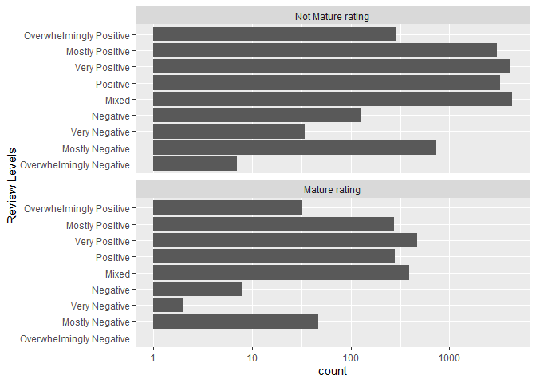
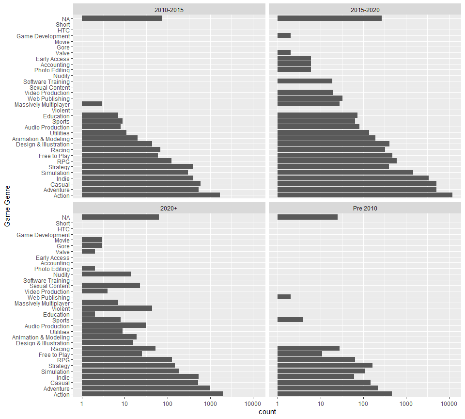
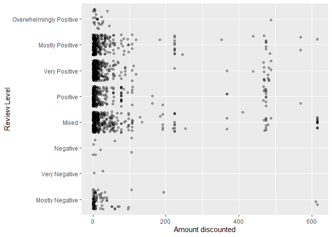
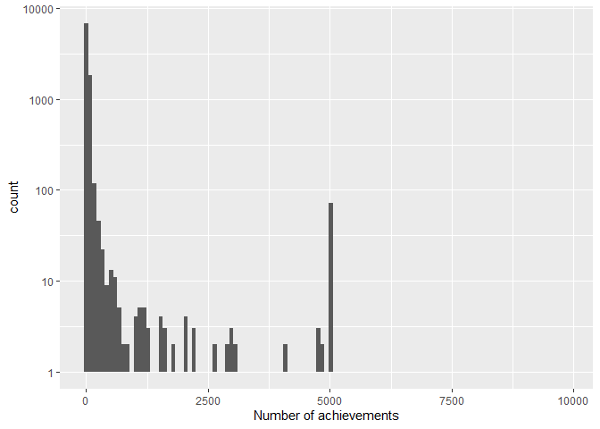
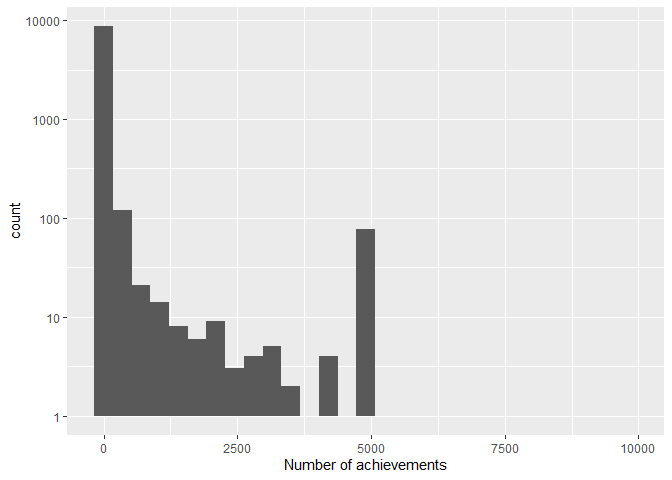
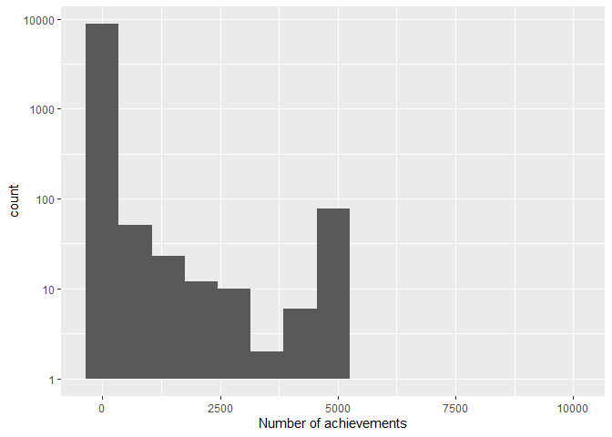

Mini Data Analysis Milestone 2
================

# Welcome back to your mini data analysis project!

This time, we will explore more in depth the concept of *tidy data*, and
hopefully investigate further into your research questions that you
defined in milestone 1.

**NOTE**: The main purpose of the mini data analysis is to integrate
what you learn in class in an analysis. Although each milestone provides
a framework for you to conduct your analysis, it’s possible that you
might find the instructions too rigid for your data set. If this is the
case, you may deviate from the instructions – just make sure you’re
demonstrating a wide range of tools and techniques taught in this class.

Begin by loading your data and the tidyverse package below:

``` r
suppressMessages(library(datateachr)) 
suppressMessages(library(tidyverse))
suppressMessages(library(stringr))
```

# Learning Objectives

By the end of this milestone, you should:

-   Become familiar with manipulating and summarizing your data in
    tibbles using `dplyr` and `tidyr`, with a research question in mind.
-   Understand what *tidy* data is, and how to create it. In milestone
    3, we will explore when this might be useful.
-   Generate a reproducible and clear report using R Markdown.
-   Gain a greater understanding of how to use R to answer research
    questions about your data.

**Things to keep in mind**

-   Remember to document your code, be explicit about what you are
    doing, and write notes in this markdown document when you feel that
    context is required. Create your analysis as if someone else will be
    reading it! **There will be 2.5 points reserved for reproducibility,
    readability, and repo organization.**

-   Before working on each task, you should always keep in mind the
    specific **research question** that you’re trying to answer.

# Task 1: Process and summarize your data (15 points)

From milestone 1, you should have an idea of the basic structure of your
dataset (e.g. number of rows and columns, class types, etc.). Here, we
will start investigating your data more in-depth using various data
manipulation functions.

### 1.1 (2.5 points)

First, write out the 4 research questions you defined in milestone 1
were. This will guide your work through milestone 2:

<!-------------------------- Start your work below ---------------------------->

1.  *How does having a mature rating effect the rating of games in
    horror and violent game compared to other genres?*
2.  *Which game genre have the highest rating and has this changed
    overtime?*
3.  *How does discounting a game affect the rating of the game?*
4.  *To what extent does the number of achievements in a game affect
    their rating?*
    <!----------------------------------------------------------------------------->

### 1.2 (10 points)

Now, for each of your four research questions, choose one task from
options 1-4 (summarizing), and one other task from 4-8 (graphing). You
should have 2 tasks done for each research question (8 total). Make sure
it makes sense to do them! (e.g. don’t use a numerical variables for a
task that needs a categorical variable.). Comment on why each task helps
(or doesn’t!) answer the corresponding research question.

Ensure that the output of each operation is printed!

**Summarizing:**

1.  Compute the *range*, *mean*, and *two other summary statistics* of
    **one numerical variable** across the groups of **one categorical
    variable** from your data.
2.  Compute the number of observations for at least one of your
    categorical variables. Do not use the function `table()`!
3.  Create a categorical variable with 3 or more groups from an existing
    numerical variable. You can use this new variable in the other
    tasks! *An example: age in years into “child, teen, adult, senior”.*
4.  Based on two categorical variables, calculate two summary statistics
    of your choosing.

**Graphing:**

5.  Create a graph out of summarized variables that has at least two
    geom layers.
6.  Create a graph of your choosing, make one of the axes logarithmic,
    and format the axes labels so that they are “pretty” or easier to
    read.
7.  Make a graph where it makes sense to customize the alpha
    transparency.
8.  Create 3 histograms out of summarized variables, with each histogram
    having different sized bins. Pick the “best” one and explain why it
    is the best.

Make sure it’s clear what research question you are doing each operation
for!

<!------------------------- Start your work below ----------------------------->

***1.2.1 How does having a mature rating effect the rating of games in
horror and violent game compared to other genres?***

*Summarizing: Task 2*

``` r
# Vector of all possible review level
review_level=c('Overwhelmingly Negative', 'Mostly Negative', 'Very Negative', 'Negative', 'Mixed',
          'Positive', 'Very Positive','Mostly Positive','Overwhelmingly Positive')


games_maturity_review <- steam_games %>% 
  mutate(mature = grepl("Mature", mature_content)) %>% # TRUE if mature_content contains the word mature
  select(id, all_reviews, mature) %>%  # Select review level and mature
  separate(all_reviews, sep=',', into=c("review"), remove=FALSE, extra = "drop", fill = "right") %>%
  # Get review level by parsing string based on comma deliminator and keeping first object
  filter(review %in% review_level) # Remove entries that have wrong formatting (e.g different)

games_maturity_review %>%
  group_by(review, mature) %>% 
  summarise(n=n()) # Show number of games grouped by review and mature
```

    ## `summarise()` has grouped output by 'review'. You can override using the `.groups` argument.

    ## # A tibble: 17 x 3
    ## # Groups:   review [9]
    ##    review                  mature     n
    ##    <chr>                   <lgl>  <int>
    ##  1 Mixed                   FALSE   4292
    ##  2 Mixed                   TRUE     388
    ##  3 Mostly Negative         FALSE    735
    ##  4 Mostly Negative         TRUE      47
    ##  5 Mostly Positive         FALSE   3037
    ##  6 Mostly Positive         TRUE     274
    ##  7 Negative                FALSE    127
    ##  8 Negative                TRUE       8
    ##  9 Overwhelmingly Negative FALSE      7
    ## 10 Overwhelmingly Positive FALSE    289
    ## 11 Overwhelmingly Positive TRUE      32
    ## 12 Positive                FALSE   3271
    ## 13 Positive                TRUE     280
    ## 14 Very Negative           FALSE     35
    ## 15 Very Negative           TRUE       2
    ## 16 Very Positive           FALSE   4070
    ## 17 Very Positive           TRUE     469

The summary table above shows the number of observations grouped by
review level and whether a game has a mature rating. We can see that
there are less games that have mature rating at each review level. The
group with the most observation is mixed review level without a mature
rating. This is important summary table as it provides an overview of
the organized data needed to answer this research question.

*Graphing: Task 6*

``` r
mature.labs <- c('Mature rating', 'Not Mature rating') # Used to create facet title
names(mature.labs) <- c(TRUE, FALSE)

games_maturity_review %>%
  ggplot(aes(factor(review, levels = review_level))) + # X axis is review level (ordered from most negative to most positive)
  geom_bar() + # Bar chart
  facet_wrap(~mature, ncol = 1, labeller = labeller (mature = mature.labs)) + # Faceted based on whether it has mature rating or not 
  scale_y_continuous(trans = 'log10') + # Make count in log10 scale
  coord_flip() + # Flip graph to see review levels more clearly
  xlab('Review Levels')
```

<!-- -->

The graph above is a bar chart showing the frequency of games at each
review level faceted based on whether it has maturity rating. As shown
in the summary table above, the frequency of the games in each category
ranges from 0 to 4292, thus I decided to use log10 scale. This makes the
data easier to read and interpret. This graph is important as it
directly answers the first part of the research question which is
investigating the relationship between review level and maturity rating.

***1.2.2 Which game genre have the highest rating and has this changed
overtime?***

*Summarizing: Task 2*

``` r
steam_games %>%
  # Only keep the first genre in genre list
  separate(genre, sep=',', into=c("genre"), remove=TRUE, extra = "drop", fill = "right") %>% 
  group_by(genre) %>% 
  summarize(n = n()) # Display number of games in each genre
```

    ## # A tibble: 32 x 2
    ##    genre                     n
    ##    <chr>                 <int>
    ##  1 Accounting                6
    ##  2 Action                16290
    ##  3 Adventure              6854
    ##  4 Animation & Modeling    231
    ##  5 Audio Production        122
    ##  6 Casual                 6348
    ##  7 Design & Illustration   471
    ##  8 Early Access              6
    ##  9 Education                83
    ## 10 Free to Play            577
    ## # ... with 22 more rows

For this research question, I had trouble categorizing games into
genres. The original data set had a column for genre, however, the
values are a list of genres which is difficult to analyze and represent
graphically. Therefore, I decided to take the first genre listed in each
game as it’s genre.

The summary table above shows that number of observation for each genre.
The value in the original genre column have a alphabetized list of
genres, thus taking the first genre of each list will result bias in
genre frequency. As shown in the table above, “Action” and “Adventure”
has high n number because they tend to appear early in the list of genre
in the original data set. This helps answer the research question as it
shows the number of observation in the grouped data used to answer the
questions.

*Graphing: Task 2*

``` r
steam_games %>%
  separate(genre, sep=',', into=c("genre"), remove=TRUE, extra = "drop", fill = "right") %>% 
  drop_na(release_date) %>% # Remove NA values
  mutate(release_date = format(as.Date(release_date, '%b %d, %Y'), format='%Y')) %>%  
  mutate(release_date_group = case_when(release_date < 2010 ~ 'Pre 2010', # Group release dates 
                                        release_date < 2015 ~ '2010-2015',
                                        release_date < 2020 ~ '2015-2020',
                                        TRUE ~ '2020+')) %>%
  ggplot(aes(reorder(genre,genre,function(x)-length(x)))) + # X axis is genre (Order based on frequency)
  facet_wrap( ~release_date_group) + # Facet based on release date grouping above
  geom_bar() + # Bar chart
  coord_flip() + # Flip graph to see genre more clearly
  xlab('Game Genre') + #Chang x axis
  scale_y_continuous(trans = 'log10')  # Make frequency into log10 
```

<!-- -->

I investigated the relationship between release date and frequency of
game genres to answer this research question. The data is faceted into 4
category based on their release date and the frequency of each game
genre is plotted. Similar to the previous graph, the range of genre
frequency is quite large, thus I decided to do a log10 transformation on
the genre count. This graphs is the first step in answering the research
question, next would be to take into consideration the review levels of
each game. Some observations of the graph above is that over time there
is a greater variety of games, for example, before 2015, there are few
Massively Multiplayer games or games with gore whereas after 2015, there
is an increase in frequency in these games.

***1.2.3 How does discounting a game affect the rating of the game?***

*Summarizing: Task 1*

``` r
game_reivew_price <- steam_games %>%
  # Get review level by parsing string based on comma deliminator and keeping first object
  separate(all_reviews, sep=',', into=c("review"), remove=FALSE, extra = "drop", fill = "right") %>%
  filter(review %in% review_level) %>% # Remove reviews not in correct format (e.g not enough review or NA)
  select(id, original_price, discount_price, review) %>% # Keep ID, original price and discount price column
  filter(original_price > discount_price) %>% # Remove games where discount price is greater than original price
  mutate(discount = original_price - discount_price) # Create new column which is the amount discounted

game_reivew_price %>%
  group_by(review) %>%
  summarize(mean_discount = mean(discount), # Provide statistical summary of discount grouped by review level
            median_discount = median(discount),
            max_discount = max(discount),
            min_discount = min(discount),
            stdev_discount = sd(discount),
            n = n())
```

    ## # A tibble: 8 x 7
    ##   review  mean_discount median_discount max_discount min_discount stdev_discount
    ##   <chr>           <dbl>           <dbl>        <dbl>        <dbl>          <dbl>
    ## 1 Mixed            58.7           11.4         614.        0.0100          130. 
    ## 2 Mostly~          30.0            5.29        614.        0.0100           92.1
    ## 3 Mostly~          45.4            8.92        614.        0.0100          104. 
    ## 4 Negati~          38.1           13.4         106.        0.2              45.9
    ## 5 Overwh~          31.8           12           488.        0.210            93.8
    ## 6 Positi~          44.0            6.25        568.        0.0100          108. 
    ## 7 Very N~          15.2           15.2          27.5       3                17.3
    ## 8 Very P~          36.7            9.89        488.        0.0100           96.3
    ## # ... with 1 more variable: n <int>

The summary table above shows the summary statistics of the amount games
were discounted including mean, median, maximum, minimum, standard
deviation and n number. These statistical summary are grouped based on
review level. Games which are not discounted or had discounted price
higher than original price were removed. This is important to the
research question because it provides an overview on the relationship
between review level and discount. For example, while the mean and
median were generally similar between review level (with the exception
of very negative and mixed), the standard deviation of negative, very
negative and mostly negative had low standard deviation indicating that
few games had large discounts. However, this may be due to having more
games in the database that are mixed or positve.

*Graphing: Task 7*

``` r
game_reivew_price %>%
  ggplot(aes(factor(review, levels = review_level), discount)) + # X axis is review level (ordered from most negative to most positive)
  geom_jitter(alpha=0.3) + # Use jitter plot with alpha transparency
  coord_flip() + # Flip graph to show review level better
  xlab('Review Level') + # Change x axis
  ylab('Amount discounted')
```

<!-- -->

The jitter plot above explores the relationship between the amount
discounted from the game and the review level. We hypothesized that
games with larger discount may be associated with better reviews because
people feel like they it is more worth it to get it on sale. The graph
above shows that negative, very negative and mostly negative games tend
to have less discount however, this may be due to simply having less
games that are negatively reviewed as mentioned before. Not only are
there more positively rated game with discounts but there is a much
greater discount. It is important to note that I have filtered out games
with no discount (or discounted price greater than original price),
hence, every dot in the plot is a game that has been discounted. I
decided to add alpha transparency of 0.3 as there were many games that
had a small discount. With the alpha transparency, it clearly shows more
games with small discount were rated positively than negatively.

***1.2.4 To what extent does the number of achievements in a game affect
their rating?***

*Summarizing: Task 1*

``` r
game_review_achievement <- steam_games %>%
  # Get review level by parsing string based on comma deliminator and keeping first object
  separate(all_reviews, sep=',', into=c("review"), remove=FALSE, extra = "drop", fill = "right") %>%
  filter(review %in% review_level) %>% # Remove reviews not in correct format (e.g not enough review or NA)
  select(achievements, review) %>% # Keep achievements and review column
  drop_na(achievements) # Remove games with NA as achievements

game_review_achievement %>%
  group_by(review) %>%
  summarize(mean_achievements = mean(achievements), # Display summary statistic of achievmenet grouped by review
            median_achievements = median(achievements),
            max_achievements = max(achievements),
            min_achievements = min(achievements),
            stdev_achievements = sd(achievements),
            n = n())
```

    ## # A tibble: 9 x 7
    ##   review     mean_achievemen~ median_achievem~ max_achievements min_achievements
    ##   <chr>                 <dbl>            <dbl>            <dbl>            <dbl>
    ## 1 Mixed                 128.              23               5000                1
    ## 2 Mostly Ne~            148.              19               5000                1
    ## 3 Mostly Po~            112.              25               9821                1
    ## 4 Negative               32.0             14                360                1
    ## 5 Overwhelm~             46               46                 46               46
    ## 6 Overwhelm~             76.0             30               2880                1
    ## 7 Positive              100.              20               5000                1
    ## 8 Very Nega~             23.4             22.5               49                9
    ## 9 Very Posi~             44.6             27               3000                1
    ## # ... with 2 more variables: stdev_achievements <dbl>, n <int>

I first looked at the statistical summary of the number of achievements.
For each review level, the mean, median, max, min, standard deviation
and n number was calculated. Note that for the statistical summary
above, games that had no achievements were filtered out as it skewed the
data significantly resulting in uninteresting statistical summary. The
median achievements is around 20-30 for each review level. The mean
achievement is highest among mixed review games and mostly negative
games. This is important to our research question because gives us an
over view of the relationship between achievement number and review.

*Graphing: Task 8*

``` r
review_achievement_hist <- game_review_achievement %>%
  ggplot(aes(achievements)) + # X axis is achievement number
  scale_y_continuous(trans = 'log10') + # Log10 transformation on frequency
  xlab('Number of achievements')

# Display histogram with varying bin width
review_achievement_hist + geom_histogram(binwidth = 85) 
```

    ## Warning: Transformation introduced infinite values in continuous y-axis

    ## Warning: Removed 74 rows containing missing values (geom_bar).

<!-- -->

``` r
review_achievement_hist + geom_histogram(binwidth = 350)
```

    ## Warning: Transformation introduced infinite values in continuous y-axis

    ## Warning: Removed 13 rows containing missing values (geom_bar).

<!-- -->

``` r
review_achievement_hist + geom_histogram(binwidth = 700)
```

    ## Warning: Transformation introduced infinite values in continuous y-axis

    ## Warning: Removed 6 rows containing missing values (geom_bar).

<!-- -->

Afterwards, the distribution of achievements were plotted for
visualization. As shown in the histogram above, most games contained no
achievements at all and the data is skewed towards having low number of
achievements as expected. The histogram is shown above with 3 different
bin width, 85, 350 and 700 in order to determine which is most
appropriate to represent the data. I think that the histogram with bin
width of 85 contained too many empty bins while bin width of 700
displayed too little bins to effectively represent the data. Therefore,
I believe that bin width 350 is best as it is able to show a smooth
distribution while having sufficient number of bins. For all 3 bin
width, it is difficult to see the bins of outlier games with over 5000
achievements, however, this is a minor issue as there are few data point
that had achievement number greater than 5000. This is important to
answer our research question as it is important to investigate the
distribution of achievement numbers in general before investigating
achievement distribution after grouped by review level or game genres.

<!----------------------------------------------------------------------------->

### 1.3 (2.5 points)

Based on the operations that you’ve completed, how much closer are you
to answering your research questions? Think about what aspects of your
research questions remain unclear. Can your research questions be
refined, now that you’ve investigated your data a bit more? Which
research questions are yielding interesting results?

<!------------------------- Write your answer here ---------------------------->

***1.3.1 How does having a mature rating effect the rating of games in
horror and violent game compared to other genres?***

The graph above showed the frequency of games grouped by rating level
and faceted based on whether there is a maturity rating. However, the
results suggest that maturity rating does not affect game rating. Both
the mature rated games and not mature rated games show a similar
distribution among rating levels. However, it may be worth while to
investigate whether this relationship remains true in different genre.
We hypothesize that game genre that is well suited for a mature rating
such as horror, violent or gore genre may have higher rating with a
mature rating compared to other game genres such as strategy or action
games. It may be better to focus the research question on whether the
horror, violent or gore genre benefit from having a mature rating
compared to other genres.

***1.3.2 Which game genre have the highest rating and has this changed
overtime?***

In this mini-data analysis, we explored the distribution of game genres
over time. As mentioned above, we noticed that over time there is a
greater variety of games genres being released. Games with genres such
as gore and massive multiplayer only started being released after the
2015. Moreover, action, adventure and casual game genre was consistently
the most frequent game over time, however, this may be due to data
processing bias as discussed previously. The next step would be to look
at similar data across positively rated games compared to negatively
rated games to see if there are any specific genre that yields
interesting results.

***1.3.2 How does discounting a game affect the rating of the game?***

In our analysis, we found that games with discount tend to skew towards
having a higher rating. As shown in the jotter plot above, games that
are discounted have positive or mixed review and the discounts are
typically higher. However, this may be biased because there is more
games that have positive review than negative review. It would be
important to compared rating of games that are not discounted vs
discounted to ensure that the relationship we are observing is not due
to bias in the data.

***1.3.4 To what extent does the number of achievements in a game affect
their rating?***

Lastly, one of the research questions investigates the relationship
between game rating and achievements. This may help game developers
decide on whether game achievements contribute to the player’s enjoyment
of the game. In this paper, we looked at the distribution of game
achievements. Most games tend to have very few or no achievements. The
next step would be to look at this distribution in positively rated
games compared to negatively rated games.

<!----------------------------------------------------------------------------->

# Task 2: Tidy your data (12.5 points)

In this task, we will do several exercises to reshape our data. The goal
here is to understand how to do this reshaping with the `tidyr` package.

A reminder of the definition of *tidy* data:

-   Each row is an **observation**
-   Each column is a **variable**
-   Each cell is a **value**

*Tidy’ing* data is sometimes necessary because it can simplify
computation. Other times it can be nice to organize data so that it can
be easier to understand when read manually.

### 2.1 (2.5 points)

Based on the definition above, can you identify if your data is tidy or
untidy? Go through all your columns, or if you have \>8 variables, just
pick 8, and explain whether the data is untidy or tidy.

<!--------------------------- Start your work below --------------------------->

In terms of the data organization, the original steam_games data set is
tidy. Each row in the data set correspond to a single unique observation
(single game). For example, id and name is a unique identifier for each
observation and does not repeat in multiple rows. Each row describes a
specific games, the recent_review, developer, publisher, original_price,
discount_price and genre are variables which are specific to a single
observation.

However, the data is untidy in term of each cell being a single value.
For example, the recent_reviews and all_review is a string containing
the review level, number of reviews and additional statistics regarding
review. This makes it difficult to do analysis as there is multiple
values within each cell in those columns. As shown in the data analysis
above, we had to parse and separate the string using comma deliminator
to obtain the review level. Similarly, the popular tags and genre
columns contained cell in the format of comma separated strings which is
difficult to simply analyze without parsing the data.

<!----------------------------------------------------------------------------->

### 2.2 (5 points)

Now, if your data is tidy, untidy it! Then, tidy it back to it’s
original state.

If your data is untidy, then tidy it! Then, untidy it back to it’s
original state.

Be sure to explain your reasoning for this task. Show us the “before”
and “after”.

<!--------------------------- Start your work below --------------------------->

``` r
untidy <- steam_games %>%
  select(id, url, name, release_date, types, original_price, discount_price, recent_reviews, all_reviews) %>%
  # Pivot longer to untidy date using review type and price type as new columns 
  pivot_longer(cols = c(recent_reviews, all_reviews), names_to = 'review_type', values_to = 'review_value') %>%
  pivot_longer(cols = c(original_price, discount_price), names_to = 'price_type', values_to = 'price')

head(untidy)
```

    ## # A tibble: 6 x 9
    ##      id url   name  release_date types review_type review_value price_type price
    ##   <dbl> <chr> <chr> <chr>        <chr> <chr>       <chr>        <chr>      <dbl>
    ## 1     1 http~ DOOM  May 12, 2016 app   recent_rev~ Very Positi~ original_~  20.0
    ## 2     1 http~ DOOM  May 12, 2016 app   recent_rev~ Very Positi~ discount_~  15.0
    ## 3     1 http~ DOOM  May 12, 2016 app   all_reviews Very Positi~ original_~  20.0
    ## 4     1 http~ DOOM  May 12, 2016 app   all_reviews Very Positi~ discount_~  15.0
    ## 5     2 http~ PLAY~ Dec 21, 2017 app   recent_rev~ Mixed,(6,21~ original_~  30.0
    ## 6     2 http~ PLAY~ Dec 21, 2017 app   recent_rev~ Mixed,(6,21~ discount_~  NA

``` r
tidy <- untidy %>%
  # Retidy data by using pivot wider
  pivot_wider(id_cols = c(-price_type, -price), names_from = price_type, values_from = price) %>% 
  pivot_wider(id_cols = c(-review_type, -review_value), names_from = review_type, values_from = review_value)

head(tidy)
```

    ## # A tibble: 6 x 9
    ##      id url           name      release_date types original_price discount_price
    ##   <dbl> <chr>         <chr>     <chr>        <chr>          <dbl>          <dbl>
    ## 1     1 https://stor~ DOOM      May 12, 2016 app             20.0           15.0
    ## 2     2 https://stor~ PLAYERUN~ Dec 21, 2017 app             30.0           NA  
    ## 3     3 https://stor~ BATTLETE~ Apr 24, 2018 app             40.0           NA  
    ## 4     4 https://stor~ DayZ      Dec 13, 2018 app             45.0           NA  
    ## 5     5 https://stor~ EVE Onli~ May 6, 2003  app              0             NA  
    ## 6     6 https://stor~ Grand Th~ NaN          bund~           NA             35.2
    ## # ... with 2 more variables: recent_reviews <chr>, all_reviews <chr>

As the organization of the data is considered tidy, I have decided to
untidy the data. The table above is untidy because each row is no longer
a single observation, for example, the first four rows are all in
relationship to the “Doom” game. The review_type and price_type columns
are not variables but instead are category for review_value and price
respectively. This is difficult to perform analysis on as each row does
not correspond to a single observation. For example, if I attempted to
analyze the relationship between release_date and price, this would not
work as each game will have two prices, further processing would be
required (e.g filtering for original_price only in price_type).

If this was the organization of the original data set, I would need to
use the pivot_longer function in order to merge the first four rows into
one observation. As shown in the organized data set, it is a lot easier
to analyze relationship between two variables as each row is an
observation, each column is a variable and each cell is a value.
<!----------------------------------------------------------------------------->

### 2.3 (5 points)

Now, you should be more familiar with your data, and also have made
progress in answering your research questions. Based on your interest,
and your analyses, pick 2 of the 4 research questions to continue your
analysis in milestone 3, and explain your decision.

Try to choose a version of your data that you think will be appropriate
to answer these 2 questions in milestone 3. Use between 4 and 8
functions that we’ve covered so far (i.e. by filtering, cleaning,
tidy’ing, dropping irrelvant columns, etc.).

<!--------------------------- Start your work below --------------------------->

***2.3.1 How does discounting a game affect the rating of the game?***

I decided to continue my analysis on the effect of game discount with
game rating. Currently, in this paper, I have found a general trend
towards games with discount with mixed or positive rating. However, as
mentioned above, there may be some bias as there is simply more games in
the data set with positive rating. Further analysis that can be done
with this research question is looking at frequency of discount vs
non-discount for each rating level. Moreover, we excluded games that had
discount price higher than original price however, this occurs because
it is a marketing strategy. We can perform analysis on whether this
correlate with rating and number of player (use number of reviews as
proxy).

``` r
steam_games %>%
  # Get review level by parsing string based on comma deliminator and keeping first object
  separate(all_reviews, sep=',', into=c("review"), remove=FALSE, extra = "drop", fill = "right") %>%
  filter(review %in% review_level) %>% # Remove reviews not in correct format (e.g not enough review or NA) 
  mutate(num_reviews = stringr::str_extract(string = all_reviews, 
                                               pattern = "(?<=\\().*(?=\\))")) %>% # Obtain number of review based on value in bracket
  mutate(discount_price = case_when(is.na(discount_price) ~ original_price,
                                    TRUE ~ discount_price)) %>% # change discount price with NA to original price
  drop_na(original_price) %>% # Remove games without price 
  select(id, original_price, discount_price, review, num_reviews) %>% # Keep columns related to price and reviews
  mutate(discount = original_price - discount_price) # Create new column that is discount amount
```

    ## # A tibble: 16,966 x 6
    ##       id original_price discount_price review          num_reviews discount
    ##    <dbl>          <dbl>          <dbl> <chr>           <chr>          <dbl>
    ##  1     1           20.0           15.0 Very Positive   42,550          5   
    ##  2     2           30.0           30.0 Mixed           836,608         0   
    ##  3     3           40.0           40.0 Mostly Positive 7,030           0   
    ##  4     4           45.0           45.0 Mixed           167,115         0   
    ##  5     5            0              0   Mostly Positive 11,481          0   
    ##  6     7           60.0           70.4 Very Positive   9,645         -10.4 
    ##  7     8           15.0           17.6 Very Positive   23,763         -2.59
    ##  8     9           30.0           30.0 Very Positive   12,127          0   
    ##  9    10           50.0           50.0 Mixed           904             0   
    ## 10    11           20.0           20.0 Very Positive   4,600           0   
    ## # ... with 16,956 more rows

***2.3.2 Do the number of achievements in a game affect their rating?***

Secondly, I decided to continue to investigate the relationship between
achievement number and game rating in various genres. In this paper, we
mainly focused on the summary statistics in this paper such as the mean,
range, standard deviation and distribution. To continue to analysis, we
could plot the achievement number for each rating to determine if there
is a relationship. This could be faceted into the common genres to see
if it yields any interesting result. This can help advise game developer
on whether they should add achievements to their games and if this
contributes to player’s enjoyment. The following table is a filtered and
tidy data set which is appropriate for answering this research question

``` r
steam_games %>%
  # Get review level by parsing string based on comma deliminator and keeping first object
  separate(all_reviews, sep=',', into=c("review"), remove=FALSE, extra = "drop", fill = "right") %>%
  filter(review %in% review_level) %>% # Remove reviews not in correct format (e.g not enough review or NA) 
  # Change release_date to date format and keep year only
  separate(genre, sep=',', into=c("genre"), remove=TRUE, extra = "drop", fill = "right") %>%
  select(id, achievements, review, genre) %>% # Keep columns related to achievement review and genre
  mutate(achievements = case_when(is.na(achievements) ~ 0, # Change achievements with NA to 0 
                                    TRUE ~ achievements))
```

    ## # A tibble: 17,363 x 4
    ##       id achievements review          genre    
    ##    <dbl>        <dbl> <chr>           <chr>    
    ##  1     1           54 Very Positive   Action   
    ##  2     2           37 Mixed           Action   
    ##  3     3          128 Mostly Positive Action   
    ##  4     4            0 Mixed           Action   
    ##  5     5            0 Mostly Positive Action   
    ##  6     7           51 Very Positive   Action   
    ##  7     8           55 Very Positive   Adventure
    ##  8     9           34 Very Positive   Strategy 
    ##  9    10           43 Mixed           Action   
    ## 10    11           72 Very Positive   Adventure
    ## # ... with 17,353 more rows

<!----------------------------------------------------------------------------->

*When you are done, knit an `md` file. This is what we will mark! Make
sure to open it and check that everything has knitted correctly before
submitting your tagged release.*

### Attribution

Thanks to Victor Yuan for mostly putting this together.
