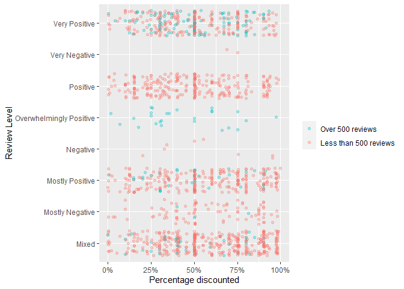
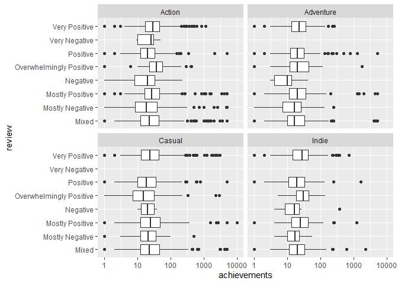
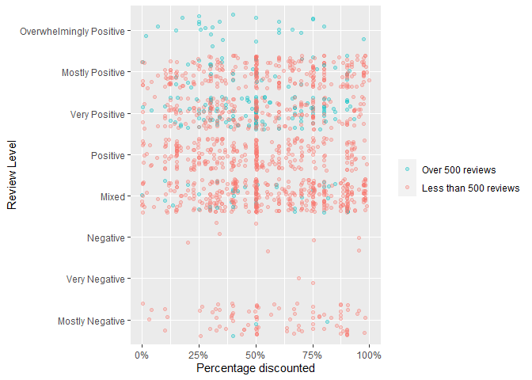
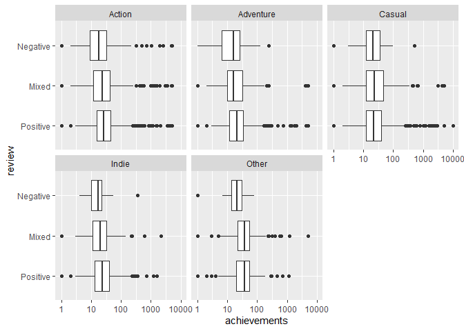

Mini Data-Analysis Deliverable 3
================

# Welcome to your last milestone in your mini data analysis project!

In Milestone 1, you explored your data and came up with research
questions. In Milestone 2, you obtained some results by making summary
tables and graphs.

In this (3rd) milestone, you’ll be sharpening some of the results you
obtained from your previous milestone by:

-   Manipulating special data types in R: factors and/or dates and
    times.
-   Fitting a model object to your data, and extract a result.
-   Reading and writing data as separate files.

**NOTE**: The main purpose of the mini data analysis is to integrate
what you learn in class in an analysis. Although each milestone provides
a framework for you to conduct your analysis, it’s possible that you
might find the instructions too rigid for your data set. If this is the
case, you may deviate from the instructions – just make sure you’re
demonstrating a wide range of tools and techniques taught in this class.

## Instructions

**To complete this milestone**, edit [this very `.Rmd`
file](https://raw.githubusercontent.com/UBC-STAT/stat545.stat.ubc.ca/master/content/mini-project/mini-project-3.Rmd)
directly. Fill in the sections that are tagged with
`<!--- start your work here--->`.

**To submit this milestone**, make sure to knit this `.Rmd` file to an
`.md` file by changing the YAML output settings from
`output: html_document` to `output: github_document`. Commit and push
all of your work to your mini-analysis GitHub repository, and tag a
release on GitHub. Then, submit a link to your tagged release on canvas.

**Points**: This milestone is worth 40 points (compared to the usual 30
points): 30 for your analysis, and 10 for your entire mini-analysis
GitHub repository. Details follow.

**Research Questions**: In Milestone 2, you chose two research questions
to focus on. Wherever realistic, your work in this milestone should
relate to these research questions whenever we ask for justification
behind your work. In the case that some tasks in this milestone don’t
align well with one of your research questions, feel free to discuss
your results in the context of a different research question.

# Setup

Begin by loading your data and the tidyverse package below:

``` r
suppressMessages(library(datateachr)) 
suppressMessages(library(tidyverse))
suppressMessages(library(broom))
```

From Milestone 2, you chose two research questions. What were they? Put
them here.

<!-------------------------- Start your work below ---------------------------->

1.  *How does discounting a game affect the rating of the game?*
2.  *To what extent does the number of achievements in a game affect
    their rating?*
    <!----------------------------------------------------------------------------->

# Exercise 1: Special Data Types (10)

For this exercise, you’ll be choosing two of the three tasks below –
both tasks that you choose are worth 5 points each.

But first, tasks 1 and 2 below ask you to modify a plot you made in a
previous milestone. The plot you choose should involve plotting across
at least three groups (whether by facetting, or using an aesthetic like
color). Place this plot below (you’re allowed to modify the plot if
you’d like). If you don’t have such a plot, you’ll need to make one.
Place the code for your plot below.

<!-------------------------- Start your work below ---------------------------->

***1.1.1 How does discounting a game affect the rating of the game?***

``` r
# Vector with all possible review level 
review_levels=c('Overwhelmingly Negative', 'Mostly Negative', 'Very Negative', 
                 'Negative', 'Mixed', 'Positive', 'Very Positive','Mostly Positive',
                 'Overwhelmingly Positive')

game_reivew_price <- steam_games %>%
  # Get review level by parsing string based on comma deliminator and keeping first object
  separate(all_reviews, sep=',', into=c("review"), remove=FALSE, extra = "drop", fill = "right") %>%
  filter(review %in% review_levels) %>% # Remove reviews not in correct format (e.g not enough review or NA) 
  mutate(num_reviews = stringr::str_extract(string = all_reviews, 
                                               pattern = "(?<=\\().*(?=\\))")) %>% # Obtain number of review based on value in bracket
  mutate(num_reviews = as.numeric(gsub(",", '', num_reviews))) %>% # Change number of review from string to int data type
  drop_na(original_price) %>% # Remove games without price 
  select(id, original_price, discount_price, review, num_reviews, release_date) %>% # Keep columns related to price and reviews
  mutate(discount = (original_price - discount_price )/original_price) %>%  # Create new column that is the percentage decrease in game price
  filter(original_price > discount_price)


game_reivew_price %>%
  ggplot(aes(review, discount)) + # X axis is review level 
  geom_jitter(aes(color = num_reviews > 500), alpha=0.3) + # Use jitter plot with alpha transparency and change color based on number of review
  coord_flip() + # Flip graph to show review level better
  xlab('Review Level') + # Change x axis
  ylab('Percentage discounted')  + # Change y axis
  scale_y_continuous(labels = scales::percent) + # Display as percentage
  scale_colour_discrete(breaks=c(TRUE, FALSE), 
                            labels=c("Over 500 reviews", "Less than 500 reviews")) + # Change color legend label
  theme(legend.title=element_blank()) # Remove legend title
```

<!-- -->

The graph above show the relationship between the percentage discount of
a game and their review levels. Additionally, the number of review are
shown using colors, games that had over 500 reviews are in blue whereas
games with less than 500 reviews are in red. This graph shows that there
are more games that are discounted with very positive, mostly positive,
positive and mixed reviews compared to games with mostly negative, very
negative or negative review. Moreover, games that are rated very
positive or overwhelmingly positive have greater number of reviews.
However, it is difficult to compare between review levels in this graph
as the review level are ordered alphabetically, thus reordering using
factor is necessary as shown in 1.2.1.

***1.1.2 To what extent does the number of achievements in a game affect
their rating?***

``` r
games_achievement <- steam_games %>%
  # Get review level by parsing string based on comma deliminator and keeping first object
  separate(all_reviews, sep=',', into=c("review"), remove=FALSE, extra = "drop", fill = "right") %>%
  filter(review %in% review_levels) %>% # Remove reviews not in correct format (e.g not enough review or NA) 
  # Change release_date to date format and keep year only
  separate(genre, sep=',', into=c("genre"), remove=TRUE, extra = "drop", fill = "right") %>%
  select(id, achievements, review, genre) %>% # Keep columns related to achievement review and genre
  mutate(achievements = case_when(is.na(achievements) ~ 0, # Change achievements with NA to 0 
                                    TRUE ~ achievements)) %>%
  drop_na(genre) %>% # Remove games without genre
  filter(achievements != 0) # Remove games with no achievement

games_achievement %>%
  filter(genre %in% c('Action', 'Indie', 'Casual', 'Adventure')) %>% # Manually filter for top genres
  ggplot(aes(review, achievements)) + # X axis is review level and y axis is achievement number
  geom_boxplot() + # Display as box plot
  scale_y_continuous(trans = 'log10') + # Transform achievement number using logg10 scale
  facet_wrap(~genre) + # Facet based on genre
  coord_flip() # Flip coordinate of graph
```

<!-- -->

The boxplot above is looking at the relationship between the number of
achievements in a game compared to their review level. Moreover, the
graph is faceted based on the top genres in the database and because we
hypothesized that casual and indie games may have lower number of
achievement than other genres such as action and adventure. The graph
above shows no major differences between genres in terms of the
relationship between review level and achievements. It is difficult to
interpret this plot as there are so much information in terms of review
level. It would be better to reduce the number of review level and
additionally add an ‘other genere’ facet to better display the data as
shown in 1.2.2.

<!----------------------------------------------------------------------------->

Now, choose two of the following tasks.

1.  Produce a new plot that reorders a factor in your original plot,
    using the `forcats` package (3 points). Then, in a sentence or two,
    briefly explain why you chose this ordering (1 point here for
    demonstrating understanding of the reordering, and 1 point for
    demonstrating some justification for the reordering, which could be
    subtle or speculative.)

2.  Produce a new plot that groups some factor levels together into an
    “other” category (or something similar), using the `forcats` package
    (3 points). Then, in a sentence or two, briefly explain why you
    chose this grouping (1 point here for demonstrating understanding of
    the grouping, and 1 point for demonstrating some justification for
    the grouping, which could be subtle or speculative.)

3.  If your data has some sort of time-based column like a date (but
    something more granular than just a year):

    1.  Make a new column that uses a function from the `lubridate` or
        `tsibble` package to modify your original time-based column. (3
        points)
        -   Note that you might first have to *make* a time-based column
            using a function like `ymd()`, but this doesn’t count.
        -   Examples of something you might do here: extract the day of
            the year from a date, or extract the weekday, or let 24
            hours elapse on your dates.
    2.  Then, in a sentence or two, explain how your new column might be
        useful in exploring a research question. (1 point for
        demonstrating understanding of the function you used, and 1
        point for your justification, which could be subtle or
        speculative).
        -   For example, you could say something like “Investigating the
            day of the week might be insightful because penguins don’t
            work on weekends, and so may respond differently”.

<!-------------------------- Start your work below ---------------------------->

***1.2.1 How does discounting a game affect the rating of the game?***

**Task Number**: 1) Produce a new plot that reorders a factor in your
original plot, using the `forcats` package

``` r
# Review levels ordered from lowest to highest
review_levels=c('Overwhelmingly Negative', 'Mostly Negative', 'Very Negative', 
                 'Negative', 'Mixed', 'Positive', 'Very Positive','Mostly Positive',
                 'Overwhelmingly Positive')

game_review_price_fct <- game_reivew_price %>%
  mutate(review = fct_relevel(review, levels = review_levels)) # Manually reordering review level from lowest to highest
```

    ## Warning: Outer names are only allowed for unnamed scalar atomic inputs

    ## Warning: Unknown levels in `f`: Overwhelmingly Negative

``` r
game_review_price_fct %>% 
  ggplot(aes(review, discount)) + # X axis is review level 
  geom_jitter(aes(color = num_reviews > 500), alpha=0.3) + # Use jitter plot with alpha transparency
  coord_flip() + # Flip graph to show review level better
  xlab('Review Level') + # Change x axis
  ylab('Percentage discounted') + # Change y axis
  scale_y_continuous(labels = scales::percent) + # Display as percentage
  scale_colour_discrete(breaks=c(TRUE, FALSE), 
                            labels=c("Over 500 reviews", "Less than 500 reviews")) +
  theme(legend.title=element_blank())
```

<!-- -->

I decided to reorder the review level from lowest review to highest
review level. This allows for a better compassion of amount discounted
between rating level to show the gradual increase in review levels. I
used fct_relevel to turn the review level into factor and manual change
the ordering as shown in the review_levels vector. For example, now it
more clearly illustrates the greater number of games discounted in
positive review level compared to negative. Furthermore, it is clearly
shown that there are more games that have over 500 reviews in positive
review level then negative.

<!----------------------------------------------------------------------------->
<!-------------------------- Start your work below ---------------------------->

***1.2.2 To what extent does the number of achievements in a game affect
their rating?***

**Task Number**: 2) Produce a new plot that groups some factor levels
together into an “other” category

``` r
games_achievement_fct <- games_achievement %>%
  mutate(genre = fct_lump_min(genre, 500)) %>% # Lump all genres with less than 1000 games into other category
  # Group review level into positive, mixed and negative
  mutate(review = factor(case_when(review %in% c('Overwhelmingly Positive', 'Positive', 'Very Positive','Mostly Positive') ~ 'Positive',
                                 review == 'Mixed' ~ 'Mixed',
                                TRUE ~ 'Negative'), levels = c('Positive', 'Mixed', 'Negative'))) 
  

games_achievement_fct %>%
  ggplot(aes(review, achievements)) +  # X axis is review level and Y axis is number of achievements
  geom_boxplot() + # Display boxplots
  scale_y_continuous(trans = 'log10') + # Perform log10 transformation on  achievement number
  facet_wrap(~genre) + # Facet based on genre
  coord_flip() # Flip graph
```

<!-- -->

For the box-plot above, I decided to group genres with less than 500
games into an other category. This is a much better solution that the
box-plot in 1.1.2 as it doesn’t hide any information and allows for a
better compassion with the rest of the data set. I used the fct_lump_min
function from the forecat library to lump all genres with less than 500
games into the other group. Moreover, I grouped all positive review
level into positive and all negative review level into negative review
in order to reduce clutter and too much information as shown in 1.1.2.
The plot above shows that negatively reviewed games tend to have lower
achievement number compared to mixed and positive games. However, there
is no signficiant change in this relationship between different genres.

<!----------------------------------------------------------------------------->

# Exercise 2: Modelling

## 2.0 (no points)

Pick a research question, and pick a variable of interest (we’ll call it
“Y”) that’s relevant to the research question. Indicate these.

<!-------------------------- Start your work below ---------------------------->

**Research Question**: To what extent does the number of achievements in
a game affect their rating?

**Variable of interest**: Number of achievements

<!----------------------------------------------------------------------------->

## 2.1 (5 points)

Fit a model or run a hypothesis test that provides insight on this
variable with respect to the research question. Store the model object
as a variable, and print its output to screen. We’ll omit having to
justify your choice, because we don’t expect you to know about model
specifics in STAT 545.

-   **Note**: It’s OK if you don’t know how these models/tests work.
    Here are some examples of things you can do here, but the sky’s the
    limit.
    -   You could fit a model that makes predictions on Y using another
        variable, by using the `lm()` function.
    -   You could test whether the mean of Y equals 0 using `t.test()`,
        or maybe the mean across two groups are different using
        `t.test()`, or maybe the mean across multiple groups are
        different using `anova()` (you may have to pivot your data for
        the latter two).
    -   You could use `lm()` to test for significance of regression.

<!-------------------------- Start your work below ---------------------------->

``` r
aov.data <- aov(achievements ~ review + genre, data=games_achievement_fct) # One-way analysis of variance modeling between achievements, review and genre.

summary(aov.data) # Displaying summary information of model
```

    ##               Df    Sum Sq Mean Sq F value   Pr(>F)    
    ## review         2 4.575e+06 2287704   8.963 0.000129 ***
    ## genre          4 2.004e+07 5010610  19.630 4.22e-16 ***
    ## Residuals   8941 2.282e+09  255253                     
    ## ---
    ## Signif. codes:  0 '***' 0.001 '**' 0.01 '*' 0.05 '.' 0.1 ' ' 1

As the research question is investigating the relationship between a
quantitative variable, achievement number, and two qualitative variable,
review level and genre, linear model would not be an appropriate model.
Therefore, I decided to use a one-way analysis of variance as there are
more than two categories for review levels and genre. The aov() function
models the relationship between achievements, review level and genre in
the games_achievement_fct data set. The summary of the one-way analysis
of variance is shown above.

<!----------------------------------------------------------------------------->

## 2.2 (5 points)

Produce something relevant from your fitted model: either predictions on
Y, or a single value like a regression coefficient or a p-value.

-   Be sure to indicate in writing what you chose to produce.
-   Your code should either output a tibble (in which case you should
    indicate the column that contains the thing you’re looking for), or
    the thing you’re looking for itself.
-   Obtain your results using the `broom` package if possible. If your
    model is not compatible with the broom function you’re needing, then
    you can obtain your results by some other means, but first indicate
    which broom function is not compatible.

<!-------------------------- Start your work below ---------------------------->

``` r
# Set of games with varying genre and review to test model
random_game = tribble(
  ~review, ~genre,
  #------|-------
  'Positive', 'Action',
  'Mixed', 'Action',
  'Negative', 'Action',
  'Positive', 'Casual',
  'Mixed', 'Casual',
  'Negative', 'Casual'
)

# Predict number of achievement based on review and genre
broom::augment(aov.data, newdata = random_game)
```

    ## Warning: Tidiers for objects of class aov are not maintained by the broom team,
    ## and are only supported through the lm tidier method. Please be cautious in
    ## interpreting and reporting broom output.

    ## # A tibble: 6 x 3
    ##   review   genre  .fitted
    ##   <chr>    <chr>    <dbl>
    ## 1 Positive Action    87.2
    ## 2 Mixed    Action   138. 
    ## 3 Negative Action   141. 
    ## 4 Positive Casual   179. 
    ## 5 Mixed    Casual   230. 
    ## 6 Negative Casual   233.

Using the one-way analysis of variance model in 2.1, we can predict the
number of achievement in a game based on the review level and genre. The
random_game tibble shows a set of six random games with varying reviews
and genres. Using the model, we can predict the number of achievements
based on the review and genre as shown in the .fitted column. The
prediction is performed using the augment function as part of the broom
library. This model can be used by game developer to determine how many
achievements they should add in the game. For example, when creating an
action game, developers should aim to add approximately 87 achievements
whereas when creating a casual game, approximately 179 achievement
should be added. However, further analysis needs to be done to determine
if these relationships are significant.

<!----------------------------------------------------------------------------->

# Exercise 3: Reading and writing data

Get set up for this exercise by making a folder called `output` in the
top level of your project folder / repository. You’ll be saving things
there.

## 3.1 (5 points)

Take a summary table that you made from Milestone 2 (Exercise 1.2), and
write it as a csv file in your `output` folder. Use the `here::here()`
function.

-   **Robustness criteria**: You should be able to move your Mini
    Project repository / project folder to some other location on your
    computer, or move this very Rmd file to another location within your
    project repository / folder, and your code should still work.
-   **Reproducibility criteria**: You should be able to delete the csv
    file, and remake it simply by knitting this Rmd file.

<!-------------------------- Start your work below ---------------------------->

``` r
achievement_summary <- games_achievement_fct %>% # Save summary statistic of achievement to achievement_summary
  group_by(review) %>% 
  summarize(mean_achievements = mean(achievements), 
            median_achievements = median(achievements),
            max_achievements = max(achievements),
            min_achievements = min(achievements),
            stdev_achievements = sd(achievements),
            n = n())
write.csv(achievement_summary, here::here('output', 'game_achievement_summary.csv')) # Write statistical summary to output directory
read.csv(here::here('output','game_achievement_summary.csv')) # Read saved data to ensure it is properly save 
```

    ##   X   review mean_achievements median_achievements max_achievements
    ## 1 1 Positive          78.23327                  24             9821
    ## 2 2    Mixed         127.70291                  23             5000
    ## 3 3 Negative         130.84150                  19             5000
    ##   min_achievements stdev_achievements    n
    ## 1                1           440.1634 6366
    ## 2                1           639.7473 2235
    ## 3                1           668.7788  347

The summary statistics for research question two was saved in a tibble
called achievement_summary. We saved this tibble into a csv file by
writing it into the output directory with the name
game_achievement_summary.csv using the write.csv() function. To ensure
that this file was saved properly, we read it using the read.csv and
shown the output above.

<!----------------------------------------------------------------------------->

## 3.2 (5 points)

Write your model object from Exercise 2 to an R binary file (an RDS),
and load it again. Be sure to save the binary file in your `output`
folder. Use the functions `saveRDS()` and `readRDS()`.

-   The same robustness and reproducibility criteria as in 3.1 apply
    here.

<!-------------------------- Start your work below ---------------------------->

``` r
saveRDS(aov.data, here::here('output','aov_achievement_review_model')) # Save One-Way ANOVA model to output directory
readRDS(here::here('output','aov_achievement_review_model')) # Read One-Way ANOVA
```

    ## Call:
    ##    aov(formula = achievements ~ review + genre, data = games_achievement_fct)
    ## 
    ## Terms:
    ##                     review      genre  Residuals
    ## Sum of Squares     4575409   20042441 2282214272
    ## Deg. of Freedom          2          4       8941
    ## 
    ## Residual standard error: 505.2254
    ## Estimated effects may be unbalanced

Similarly, to save the one-way analysis of variance model created in
2.1, saveRDS() function was used to write it to the output directory
with the name aov_achievement_review_model. As a sanity check, the model
was read using the readRDS() function to ensure the model was saved
properly. The read model was output above.

<!----------------------------------------------------------------------------->

# Tidy Repository

Now that this is your last milestone, your entire project repository
should be organized. Here are the criteria we’re looking for.

## Main README (3 points)

There should be a file named `README.md` at the top level of your
repository. Its contents should automatically appear when you visit the
repository on GitHub.

Minimum contents of the README file:

-   In a sentence or two, explains what this repository is, so that
    future-you or someone else stumbling on your repository can be
    oriented to the repository.
-   In a sentence or two (or more??), briefly explains how to engage
    with the repository. You can assume the person reading knows the
    material from STAT 545A. Basically, if a visitor to your repository
    wants to explore your project, what should they know?

Once you get in the habit of making README files, and seeing more README
files in other projects, you’ll wonder how you ever got by without them!
They are tremendously helpful.

## File and Folder structure (3 points)

You should have at least four folders in the top level of your
repository: one for each milestone, and one output folder. If there are
any other folders, these are explained in the main README.

Each milestone document is contained in its respective folder, and
nowhere else.

Every level-1 folder (that is, the ones stored in the top level, like
“Milestone1” and “output”) has a `README` file, explaining in a sentence
or two what is in the folder, in plain language (it’s enough to say
something like “This folder contains the source for Milestone 1”).

## Output (2 points)

All output is recent and relevant:

-   All Rmd files have been `knit`ted to their output, and all data
    files saved from Exercise 3 above appear in the `output` folder.
-   All of these output files are up-to-date – that is, they haven’t
    fallen behind after the source (Rmd) files have been updated.
-   There should be no relic output files. For example, if you were
    knitting an Rmd to html, but then changed the output to be only a
    markdown file, then the html file is a relic and should be deleted.

Our recommendation: delete all output files, and re-knit each
milestone’s Rmd file, so that everything is up to date and relevant.

PS: there’s a way where you can run all project code using a single
command, instead of clicking “knit” three times. More on this in STAT
545B!

## Error-free code (1 point)

This Milestone 3 document knits error-free. (We’ve already graded this
aspect for Milestone 1 and 2)

## Tagged release (1 point)

You’ve tagged a release for Milestone 3. (We’ve already graded this
aspect for Milestone 1 and 2)
